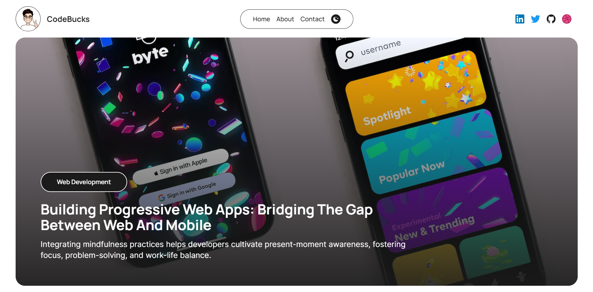

# Technorivals Blog

A modern, feature-rich blog platform built with Next.js and Storyblok CMS. This project provides a clean, responsive design with dark mode support, SEO optimization, and TypeScript integration.



## 🚀 Features

- **Next.js 15+** - Using the latest version of Next.js with Pages Router
- **Storyblok CMS Integration** - Headless CMS for content management
- **TypeScript Support** - Fully typed components and pages
- **Responsive Design** - Mobile-first approach with Tailwind CSS
- **Dark Mode** - Toggle between light and dark themes
- **SEO Optimized** - Meta tags and structured data for better search engine visibility
- **Image Optimization** - Next.js Image component for optimized images
- **Category Filtering** - Browse posts by categories
- **Sitemap Generation** - Automatic sitemap generation
- **Supabase Integration** - For view counts and other dynamic features

## 📋 Prerequisites

- Node.js 18.18.0 or later
- pnpm (recommended) or npm

## 🛠️ Installation

1. Clone the repository:
   ```bash
   git clone https://github.com/yourusername/technorivals-blog-v2.git
   cd technorivals-blog-v2
   ```

2. Install dependencies:
   ```bash
   pnpm install
   ```

3. Create a `.env.local` file in the root directory with your Storyblok API token:
   ```
   STORYBLOK_API_TOKEN=your_storyblok_api_token_here
   NEXT_PUBLIC_STORYBLOK_API_TOKEN=your_storyblok_api_token_here
   ```

## 🚀 Development

Run the development server:

```bash
pnpm dev
```

Open [http://localhost:3000](http://localhost:3000) in your browser to see the result.

## 🏗️ Build

Build the project for production:

```bash
pnpm build
```

Start the production server:

```bash
pnpm start
```

## 📝 Storyblok CMS Setup

This project is configured to work with Storyblok CMS. Follow these steps to set up your Storyblok space:

1. Create a Storyblok account at [storyblok.com](https://www.storyblok.com/)
2. Create a new space
3. Create a blog post content type with the following fields:
   - Title (text)
   - Content (rich text)
   - Image (asset)
   - Tags (multi-option)

4. Generate your API token and add it to your `.env.local` file

5. Pull Storyblok components and generate TypeScript types:
   ```bash
   pnpm pull-sb-components
   pnpm generate-sb-types
   ```

## 🧩 Project Structure

```
technorivals-blog-v2/
├── public/               # Static assets
├── src/
│   ├── app/              # App Router components
│   ├── components/       # Reusable components
│   │   ├── Blog/         # Blog-specific components
│   │   ├── Elements/     # UI elements
│   │   ├── Home/         # Homepage components
│   │   └── Storyblok/    # Storyblok-specific components
│   ├── lib/              # Library code
│   │   └── storyblok.ts  # Storyblok API utilities
│   ├── pages/            # Pages Router components
│   ├── types/            # TypeScript type definitions
│   └── utils/            # Utility functions
├── .env.local.example    # Example environment variables
├── next.config.js        # Next.js configuration
├── package.json          # Project dependencies
├── tailwind.config.js    # Tailwind CSS configuration
└── tsconfig.json         # TypeScript configuration
```

## 🎨 Customization

### Site Metadata

Edit the `src/utils/siteMetaData.ts` file to update your site's metadata:

```typescript
const siteMetadata = {
  title: "Your Site Title",
  author: "Your Name",
  headerTitle: "Your Header Title",
  description: "Your site description",
  // ...other metadata
};
```

### Styling

This project uses Tailwind CSS for styling. You can customize the theme in `tailwind.config.js`:

```javascript
theme: {
  extend: {
    colors: {
      dark: "#1b1b1b",
      light: "#fff",
      accent: "#7B00D3",
      accentDark: "#ffdb4d",
      // Add your custom colors here
    },
    // Add other customizations
  },
},
```

## 📱 Progressive Web App

This project includes PWA support. You can customize the PWA settings in `src/manifest.ts`.

## 📄 License

This project is licensed under the MIT License - see the LICENSE file for details.

## 🙏 Acknowledgements

- [Next.js](https://nextjs.org/)
- [Storyblok](https://www.storyblok.com/)
- [Tailwind CSS](https://tailwindcss.com/)
- [TypeScript](https://www.typescriptlang.org/)
- [React](https://reactjs.org/)
